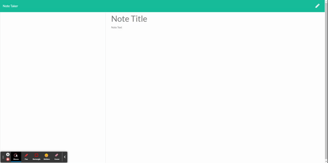

# Express-Note-Taker

The purpose of this project was to build an application that can write, save, and delete notes using an express backend to save and retrieve note data from a JSON file. The project user story is below.

 The criteria for a successful project are below: 

* Application should allow users to create and save notes.

* Application should allow users to view previously saved notes. 

* Application should allow users to delete previously saved notes. 

## Getting Started

Below is the link to the project repository, a link to the deployed application on Heroku, and a video of how the application works. 

https://github.com/andedu15/Express-Note-Taker

https://quiet-wildwood-49743-a0ee54c33119.herokuapp.com/

[]

### Development

Below are the steps I took to create the application as it is so far. The most difficult aspect of this application for me was using a constructor to cover all aspects of the notes (writing, reading, saving, deleting).  

1. Created and linked the initial files (JS files, HTML files, JSON files). 

2. Downloaded all dependecies using npm. 

3. Created a constructor which contained functions for each element of the notes (writing, reading, saving, deleting).

4. Verify the functionality of the application, then deploy to Heroku. 

## Testing

This application was not developed using Test Driven Development. However, at numerous points throughout development, console.log's were used to test the results of new elements. 

## Deployment

This program can be viewed and deployed using most internet browsers via the links in the "Getting Started" section. 

## Questions

GitHub: https://github.com/andedu15

Reach out to me at mejiandrese15@gmail.com for questions

